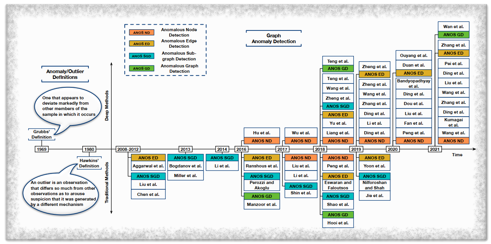
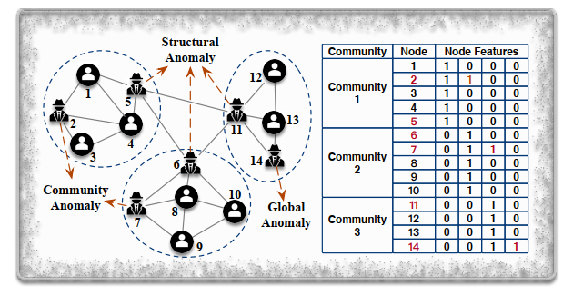
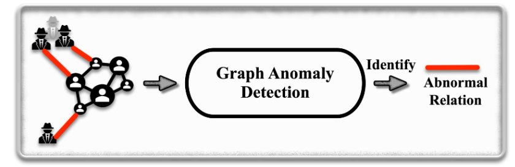
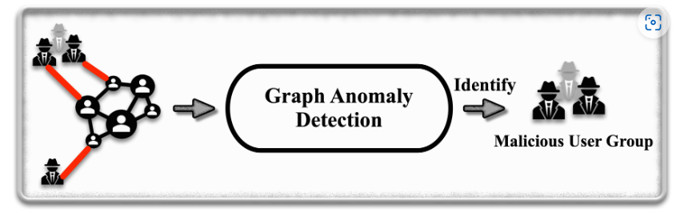
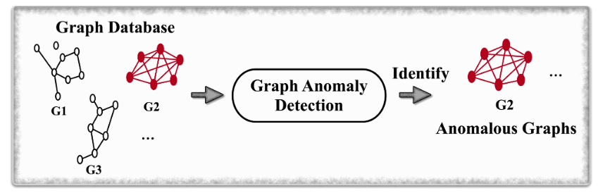

- [Graph-Anomaly-Detection](#Graph-Anomaly-Detection)
  -  [图异常检测研究的时间线](#图异常检测研究的时间线)
  - [Surveys](#Surveys)
  - [Anomalous Node Detection](#anomalous-node-detection)
  - [Anomalous Edge Detections](#Anomalous-edge-Detection)
  - [Anomalous Sub-Graph Detections](#Anomalous-Sub-Graph-Detection)
  - [Anomalous Graph Detections](#Anomalous-Graph-Detection)
  - [Datasets](#Datasets)

#  **Graph-Anomaly-Detection**

- The database integrates various elements related to graph anomaly detection algorithms, including papers, datasets, code, and other relevant materials.

## **图异常检测研究的时间线**

## **Surveys**

| 序号 |                           论文名称                           | 年份 |
| :--: | :----------------------------------------------------------: | :--: |
|  1   | [Combining machine learning with knowledge engineering to detect fake news in social networks-a survey](https://arxiv.org/abs/2201.08032) | 2022 |
|  2   | [A Comprehensive Survey on Graph Anomaly Detection With Deep Learning](https://ieeexplore.ieee.org/abstract/document/9565320) | 2021 |
|  3   | [Deep Learning for Anomaly Detection: A Review](https://dl.acm.org/doi/abs/10.1145/3439950) | 2021 |
|  4   | [Anomaly detection for big datausing efficient techniques: A review](https://link.springer.com/chapter/10.1007/978-981-15-3514-7_79) | 2021 |
|  5   | [Fraud detection: A systematic literature review of graph-based anomaly detectionapproaches](https://www.sciencedirect.com/science/article/pii/S0167923620300580) | 2020 |
|  6   | [A comprehensive surveyof anomaly detection techniques for high dimensional big data](https://journalofbigdata.springeropen.com/articles/10.1186/s40537-020-00320-x) | 2020 |
|  7   | [Outlier detection: Methods,models, and classification](https://dl.acm.org/doi/10.1145/3381028) | 2020 |
|  8   | [Anomalous instance detection in deep learning: A survey](https://www.semanticscholar.org/paper/Anomalous-Instance-Detection-in-Deep-Learning:-A-Bulusu-Kailkhura/86c12bb6fb6fb2956d1147bd1b15a788b6d07f6e) | 2020 |
|  9   | [Machine learning techniques for network anomaly detection: A survey](https://ieeexplore.ieee.org/abstract/document/9089465) | 2020 |
|  10  | [Deep learning for anomaly detection: A survey](https://arxiv.org/abs/1901.03407) | 2019 |
|  11  | [A comprehensive survey on network anomaly detection](https://link.springer.com/article/10.1007/s11235-018-0475-8) | 2019 |
|  12  | [A survey of deep learning-based network anomaly detection](https://link.springer.com/article/10.1007/s10586-017-1117-8) | 2019 |
|  13  | [A survey on social media anomaly detection](https://dl.acm.org/doi/10.1145/2980765.2980767) | 2016 |
|  14  | [Graph based anomaly detectionand description: A survey](https://link.springer.com/article/10.1007/s10618-014-0365-y) | 2015 |
|  15  | [Anomaly detection in dynamic networks: A survey](https://wires.onlinelibrary.wiley.com/doi/10.1002/wics.1347) | 2015 |
|  16  | [Anomaly detection in online social networks](https://www.sciencedirect.com/science/article/pii/S0378873314000331) | 2014 |
|  17  | [A survey ofoutlier detection methods in network anomaly identification](https://ieeexplore.ieee.org/abstract/document/8130440) | 2011 |
|  18  | [Anomaly detection: A survey](https://dl.acm.org/doi/10.1145/1541880.1541882) | 2009 |

## **Anomalous Node Detection**

三类异常节点：结构异常、社区异常和全局异常。

- 结构异常：仅考虑图的结构信息
- 社区异常：同时考虑节点特征和图的结构信息
- 全局异常：仅考虑节点的特征

| 序号 |                           文章名称                           | 年份 |    模型    |                             代码                             |
| :--: | :----------------------------------------------------------: | :--: | :--------: | :----------------------------------------------------------: |
|  1   | [Few-shot network anomalydetection via cross-network meta-learning](https://dl.acm.org/doi/10.1145/3442381.3449922) | 2021 |  Meta-GDN  | [code](https://github.com/kaize0409/Meta-GDN_AnomalyDetection) |
|  2   | [Fraudre: Fraud detection dual-resistant to graph inconsistency and imbalance](https://ieeexplore.ieee.org/document/9679178/) | 2021 |  FRAUDRE   |      [code](https://github.com/FraudDetection/FRAUDRE)       |
|  3   | [Selective network discovery via deep reinforcement learning on embedded spaces](https://appliednetsci.springeropen.com/articles/10.1007/s41109-021-00365-8) | 2021 |    NAC     |                             ---                              |
|  4   | [Cross-domain graph anomaly detection](https://ieeexplore.ieee.org/document/9556511) | 2021 | COMMANDER  |                             ---                              |
|      | [Generative and Contrastive Self-Supervised Learning for Graph Anomaly Detection](https://ieeexplore.ieee.org/document/9568697) | 2021 |   SL-GAD   |          [code](https://github.com/KimMeen/SL-GAD)           |
|  5   | [Anomaly detection on attributed networks via contrastive self-supervised learning](https://ieeexplore.ieee.org/abstract/document/9395172) | 2021 |    COLA    |          [code](https://github.com/GRAND-Lab/CoLA)           |
|  6   | [Decoupling representation learning and classification for gnn-based anomaly detection](https://dl.acm.org/doi/10.1145/3404835.3462944) | 2021 |    DCI     |         [code](https://github.com/wyl7/DCI-pytorch)          |
|  7   | [Resgcn:Attention-based deep residual modeling for anomaly detection on attributed networks](https://dl.acm.org/doi/abs/10.1007/s10994-021-06044-0) | 2021 |   ResGCN   |         [code](https://bitbucket.org/paulpei/resgcn)         |
|  8   | [One-class graph neural networks for anomaly detection in attributed networks](https://link.springer.com/article/10.1007/s00521-021-05924-9) | 2021 |   OCGNN    |        [code](https://github.com/WangXuhongCN/OCGNN)         |
|  9   | [Outlier resistant unsupervised deep architectures for attributed network embedding](https://dl.acm.org/doi/10.1145/3336191.3371788) | 2020 |    DONE    |        [code](https://github.com/vasco95/DONE_AdONE)         |
|  10  | [A deep multi-view framework for anomaly detection on attributed networks](https://ieeexplore.ieee.org/abstract/document/9162509/) | 2020 |   ALARM    |                             ---                              |
|  11  | [Error-bounded graph anomaly loss for gnns](https://dl.acm.org/doi/10.1145/3340531.3411979) | 2020 |    GAL     |            [code](https://github.com/DM2-ND/GAL)             |
|  12  | [Gcn-based user representation learning for unifying robust recommendation and fraudster detection](https://dl.acm.org/doi/abs/10.1145/3397271.3401165) | 2020 |  GraphRfi  |         [code](https://github.com/zsjdddhr/GraphRfi)         |
|  13  | [Anomalydae: Dual autoencoder foranomaly detection on attributed networks](https://ieeexplore.ieee.org/document/9053387/) | 2020 | AnomalyDAE |        [code](https://github.com/haoyfan/AnomalyDAE)         |
|  14  | [Enhancinggraph neural network-based fraud detectors against camouflaged fraudsters](https://dl.acm.org/doi/10.1145/3340531.3411903) | 2020 |  CARE-GNN  |       [code](https://github.com/YingtongDou/CARE-GNN)        |
|  15  | [Structural temporal graph neural networks for anomaly detection in dynamic graphs](https://dl.acm.org/doi/10.1145/3459637.3481955) | 2020 |   STRGNN   |     [code](https://github.com/KnowledgeDiscovery/StrGNN)     |
|  16  | [Inductive anomaly detection on attributed networks](https://dl.acm.org/doi/10.5555/3491440.3491619) | 2020 |   AEGIS    |                             ---                              |
|  17  | [Deep anomaly detection on attributed networks](https://epubs.siam.org/doi/abs/10.1137/1.9781611975673.67) | 2019 |  DOMINANT  | [code](https://github.com/kaize0409/GCN_AnomalyDetection_pytorch) |
|  18  | [A semi-supervised graph attentive network for financial fraud detection](https://ieeexplore.ieee.org/document/8970829) | 2019 |  SemiGNN   | [code](https://github.com/safe-graph/DGFraud/tree/master/algorithms/SemiGNN) |
|  19  | [Interactive anomaly detection on attributednetworks](https://dl.acm.org/doi/10.1145/3289600.3290964) | 2019 |  GraphUCB  |                             ---                              |
|  20  | [Specae: Spectral auto encoder for anomaly detection in attributed networksa](https://dl.acm.org/doi/10.1145/3357384.3358074) | 2019 |   SpecAE   |                             ---                              |
|  21  | [Outlier awarenetwork embedding for attributed networks](https://aaai.org/papers/00012-outlier-aware-network-embedding-for-attributed-networks/) | 2019 |    ONE     |          [code](https://github.com/sambaranban/ONE)          |
|  22  | [One-class adversarial nets for fraud detection](https://ojs.aaai.org/index.php/AAAI/article/view/3924) | 2019 |    OCAN    |         [code](https://github.com/PanpanZheng/OCAN)          |
|  23  | [A robust embedding method for anomaly detection on attributed networks](https://ieeexplore.ieee.org/document/8852354/) | 2019 |   REMAD    |                             ---                              |
|  24  | [Fdgars: Fraudster detection via graph convolutional networks in online app review system  ](https://dl.acm.org/doi/10.1145/3308560.3316586) | 2019 |   Fdgars   |                             ---                              |
|  25  | [Anomalous: A joint modeling approach for anomaly detection on attributed networks](https://dl.acm.org/doi/abs/10.5555/3304222.3304256) | 2018 | Anomalous  |         [code](https://github.com/zpeng27/ANOMALOUS)         |
|  26  | [Netwalk: A flexible deep embedding approach for anomaly detection in dynamic networks](https://dl.acm.org/doi/pdf/10.1145/3219819.3220024) | 2018 |  NetWalk   |         [code](https://github.com/chengw07/NetWalk)          |
|  27  | [Semi-supervised embedding in attributed networks with outliers](https://arxiv.org/abs/1703.08100) | 2018 |   SEANO    |                             ---                              |
|  28  | [Adaptive spammer detection with sparse group modeling](https://aaai.org/papers/00319-14887-adaptive-spammer-detection-with-sparse-group-modeling/) | 2017 |   SGASD    |                             ---                              |
|  29  | [Accelerated local anomaly detection via resolving attributed networks](https://dl.acm.org/doi/abs/10.5555/3172077.3172213) | 2017 |    ALAD    |         [code](https://github.com/ninghaohello/ALAD)         |
|  30  | [Anomaly detection in dynamic networksusing multi-view time-series hypersphere learning](https://dl.acm.org/doi/10.1145/3132847.3132964) | 2017 |    MTHL    |  [code](https://github.com/picsolab/Anomaly_Detection_MTHL)  |
|  31  | [Radar: Residual analysis for anomaly detection in attributed networks](https://dl.acm.org/doi/10.5555/3172077.3172187) | 2017 |   Radar    |       [code](https://github.com/szumbrunn/radar-java)        |
|  32  | [An embedding approach to anomaly detection](https://ieeexplore.ieee.org/document/7498256) | 2016 |    ---     |                             ---                              |
|  33  | [Intrusion as (anti)social communication: characterization and detection](https://dl.acm.org/doi/pdf/10.1145/2339530.2339670) | 2012 |    ---     |                             ---                              |

## **Anomalous Edge Detection**

| 序号 |                           文章名称                           | 年份 |   模型    |                         代码                         |
| :--: | :----------------------------------------------------------: | :--: | :-------: | :--------------------------------------------------: |
|  1   | [Anomaly Detection in Dynamic Graphs via Transformer](https://arxiv.org/pdf/2106.09876.pdf) | 2021 |   TADDY   | [code](https://github.com/yixinliu233/TADDY_pytorch) |
|  2   | [efraudcom: An e-commerce fraud detection system via competitive graph neural networks  ](https://dl.acm.org/doi/10.1145/3474379) | 2021 | eFraudCom |    [code](https://github.com/GeZhangMQ/eFraudCom)    |
|  3   | [Unified graph embedding-basedanomalous edge detection](https://ieeexplore.ieee.org/document/9206720) | 2020 |   UGED    |                         ---                          |
|  4   | [Aane: Anomalyaware network embedding for anomalous link detection](https://ieeexplore.ieee.org/document/9338406) | 2020 |   AANE    |                         ---                          |
|  5   | [Addgraph: Anomaly detectionin dynamic graph using attention-based temporal gcn](https://dl.acm.org/doi/abs/10.5555/3367471.3367656) | 2019 | AddGraph  |     [code](https://github.com/Ljiajie/Addgraph)      |
|  6   | [[Netwalk: A flexible deep embedding approach for anomaly detection in dynamic networks](https://dl.acm.org/doi/pdf/10.1145/3219819.3220024)](https://ieeexplore.ieee.org/document/9338406) | 2018 |  NetWalk  |     [code](https://github.com/chengw07/NetWalk)      |

## **Anmalous Sub-Graph Detection**

| 序号 |                           文章名称                           | 年份 |  模型   |                        代码                         |
| :--: | :----------------------------------------------------------: | :--: | :-----: | :-------------------------------------------------: |
|  1   | [Fraudne: A joint embedding approach for fraud detection](https://www.semanticscholar.org/paper/FraudNE%3A-a-Joint-Embedding-Approach-for-Fraud-Zheng-Zhou/da4b64ad6d9138e9192bbe1f6bda704bf34de72f) | 2018 | Fraudne |     [code](https://github.com/MY-ZHENG/FraudNE)     |
|  2   | [Deep structure learning for fraud detection](https://ieeexplore.ieee.org/abstract/document/8594881) | 2018 | DeepFD  | [code](https://github.com/zhao-tong/DeepFD-pyTorch) |

## **Anomalous Graph Detection**

| 序号 |                           文章名称                           | 年份 |    模型    |                         代码                         |
| :--: | :----------------------------------------------------------: | :--: | :--------: | :--------------------------------------------------: |
|  1   | [Glad-paw: Graph-based log anomaly detection by position aware weighted graph attention network](https://link.springer.com/chapter/10.1007/978-3-030-75762-5_6) | 2021 |  GLAD-PAW  |                         ---                          |
|  2   | [User preference-awarefake news detection](https://dl.acm.org/doi/abs/10.1145/3404835.3462990) | 2021 |    UPFD    |  [code](https://github.com/safe-graph/GNN-FakeNews)  |
|  3   | [On using classification datasets to evaluate graph outlier detection: Peculiar observations and new insights](https://arxiv.org/abs/2012.12931) | 2020 |   OCGIN    | [code](https://github.com/LingxiaoShawn/GLOD-Issues) |
|  4   | [Deep into hypersphere: Robust and unsupervised anomaly discovery in dynamic networks](https://dl.acm.org/doi/10.5555/3304889.3305039) | 2018 | DeepSphere |    [code](https://github.com/picsolab/DeepSphere)    |

## **Datasets**

### **Citation Networks**

> - ACM  [http://www.arnetminer.org/open-academic-graph](http://www.arnetminer.org/open-academic-graph)
> - Cora  [http://linqs.cs.umd.edu/projects/projects/lbc](http://linqs.cs.umd.edu/projects/projects/lbc)
> - CiteSeer  [http://linqs.cs.umd.edu/projects/projects/lbc](http://linqs.cs.umd.edu/projects/projects/lbc)
> - PubMed  [http://linqs.cs.umd.edu/projects/projects/lbc](http://linqs.cs.umd.edu/projects/projects/lbc)
> - DBLP  [http://snap.stanford.edu/data/com-DBLP.html](http://www.informatik.uni-trier.de/˜ley/db/)

### **Social Networks**

- Enron  [http://odds.cs.stonybrook.edu/#table2](http://odds.cs.stonybrook.edu/#table2)
- UCI Message  [http://archive.ics.uci.edu/ml](http://archive.ics.uci.edu/ml)
- Google+  [https://wangbinghui.net/dataset.html](https://wangbinghui.net/dataset.html)
- Twittwe Sybil  [https://wangbinghui.net/dataset.html](https://wangbinghui.net/dataset.html)
- Twitter World-Cup2014  [http://shebuti.com/SelectiveAnomalyEnsemble/](http://shebuti.com/SelectiveAnomalyEnsemble/)
- Twitter Security2014  [http://shebuti.com/SelectiveAnomalyEnsemble/](http://shebuti.com/SelectiveAnomalyEnsemble/)
- Reality Mining  [http://shebuti.com/SelectiveAnomalyEnsemble/](http://shebuti.com/SelectiveAnomalyEnsemble/)
- NYTNews  [http://shebuti.com/SelectiveAnomalyEnsemble/](http://shebuti.com/SelectiveAnomalyEnsemble/)
- Politifact  [https://github.com/safe-graph/GNN-FakeNews](https://github.com/safe-graph/GNN-FakeNews)
- Gossipcop  [https://github.com/safe-graph/GNN-FakeNews](https://github.com/safe-graph/GNN-FakeNews)

### **Co-purchasing Networks**

- Disney  [https://www.ipd.kit.edu/mitarbeiter/muellere/consub/](https://www.ipd.kit.edu/mitarbeiter/muellere/consub/)
- Amazon-v1  [https://www.ipd.kit.edu/mitarbeiter/muellere/consub/](https://www.ipd.kit.edu/mitarbeiter/muellere/consub/)
- Amazon-v2  [https://github.com/dmlc/dgl/blob/master/python/dgl/data/fraud.py](https://github.com/dmlc/dgl/blob/master/python/dgl/data/fraud.py)
- Elliptic  [https://www.kaggle.com/ellipticco/elliptic-data-set](https://www.kaggle.com/ellipticco/elliptic-data-set)
- Yelp  [https://github.com/dmlc/dgl/blob/master/python/dgl/data/fraud.py](https://github.com/dmlc/dgl/blob/master/python/dgl/data/fraud.py)

### **Transportation Networks**

- New York City Taxi  [http://www.nyc.gov/html/tlc/html/about/triprecorddata.shtml](http://www.nyc.gov/html/tlc/html/about/triprecorddata.shtml)

